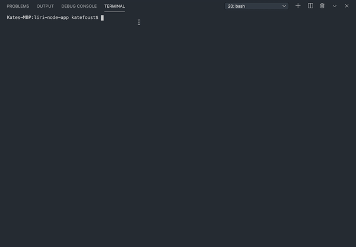

# liri-node-app

## Introduction

LIRI is a node.js application that works kind of  like Apple's SIRI. Instead of Speech Interpretation and Recognition Interface, LIRI is a Language Interpreation and Recognition Interface. LIRI works when users enter text commands via terminal. With LIRI, you can: 

* Search for upcoming concerts for an artist
* Find a song on spotify
* Find information about a movie
* Run a command with surprise results

Read this document to learn how to start using LIRI. 

## Setup

There are a couple of things you need to do before LIRI will work in your own command line. 

To set up LIRI: 

1. Get keys for the following APIs: 
    
    * Spotify
    * OMDB
    * BandsInTown
    
1. Clone the repository that includes this README: https://github.com/K8F/liri-node-app.git. 
1. Run npm install. The following packages should install: 

    * Node-Spotify-API
    * Axios (used to get data for OMDB and BandsInTown APIs)
    * Moment
    * DotEnv
    
1. Create a .env file in the same directory. Add your API keys using the following format: 

        '# Spotify API keys'
        'SPOTIFY_ID=your-spotify-ID'
        'SPOTIFY_SECRET=your-spotify-secret'

       ' # Band API keys'
        'BANDSINTOWN_API_KEY=your-api-key'

        '# OMDB API keys'
        'OMDB_API_KEY=your-api-key'
        
You should now be able to run the available commands in LIRI. 

## Using LIRI

LIRI has 4 commands: 

1. **concert-this**:  Retrieves upcoming concerts and music venues for an artist. 
1. **spotify-this-song**: Retrieves information on a song, including the artist, a preview link, and the album.
1. **movie-this**: Retrieves information on a movie, including when it came out, movie ratings, the country the movie was produced, the language it's in, the  plot, and the actors. 
1. **do-what-it-says**: Retrieves information from a text file. Run it and see what happens!

To run a command in LIRI: 

1. Open Terminal and navigate to the liri-node-app directory.
1. Check that you are in the root of the directory.  You can use `ls` to see the files in your current directory. You should see one called liri.js. 
1. If you don't see the liri.js file, `cd` to the appropriate directory.
1. To run a command, use the following syntax: 
    
    * `node liri.js <LIRI Command> <search-input>`
    
Try it out by running the `concert-this` command to see upcoming concerts for Lizzo: 

    `node liri.js concert-this lizzo`

 
Now try the `spotify-this-song` command to retrieve information on Paramore's song, "Misery Business":

    `node liri.js spotify-this-song misery business`
    

    
Next, try `movie-this` to get info on the movie, *The Lobster*: 

    `node liri.js movie this the lobster`

Finally, see what happens when you run `do-what-it-says`:

    `node liri.js do-what-it-says`

Now try out the commands for yourself. Remember to use the correct search input for each command: 

* For `concert-this`, enter an artist or band name.
* For `spotify-this-song`, enter a song name.
* For `movie-this`, enter a movie name.

## Extra Notes

This assignment asked for placeholders for both the `movie-this` and the `spotify-this-song` commands. These gifs demonstrate what happens when a user does not include a search input with these commands. 

        

